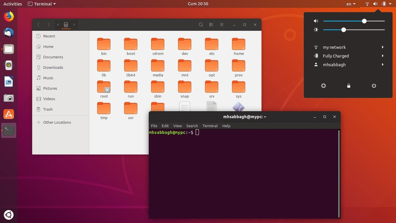
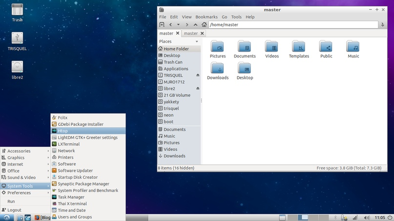
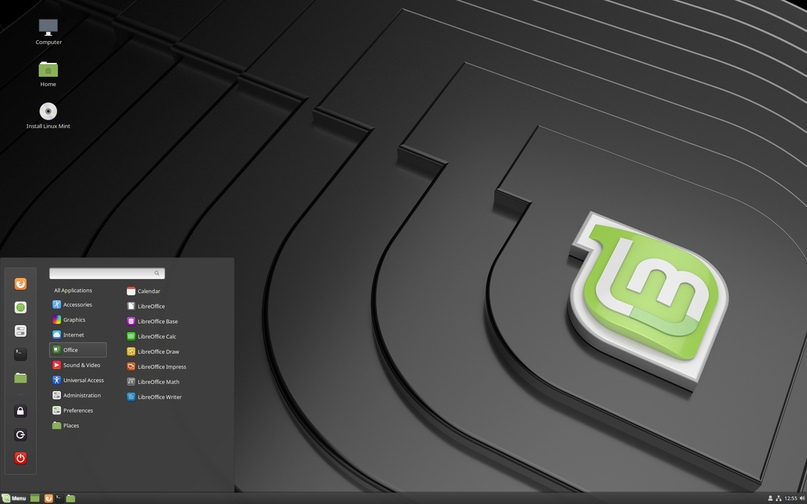
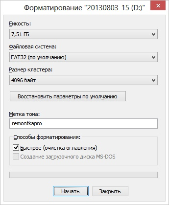
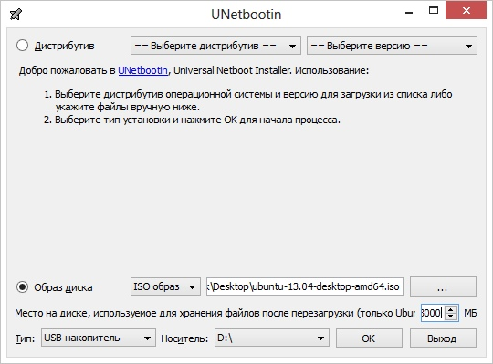
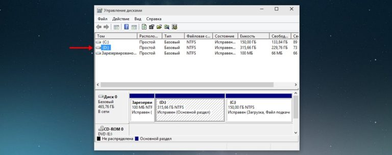
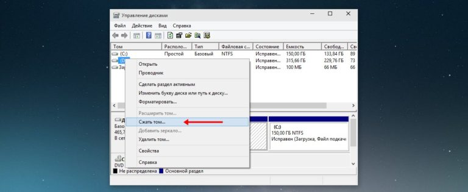
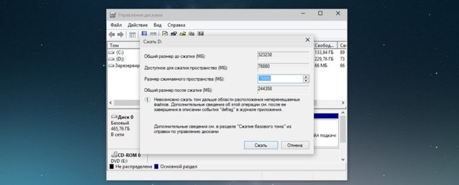
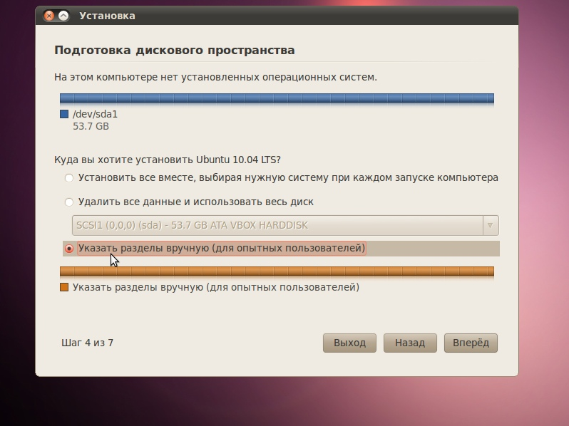
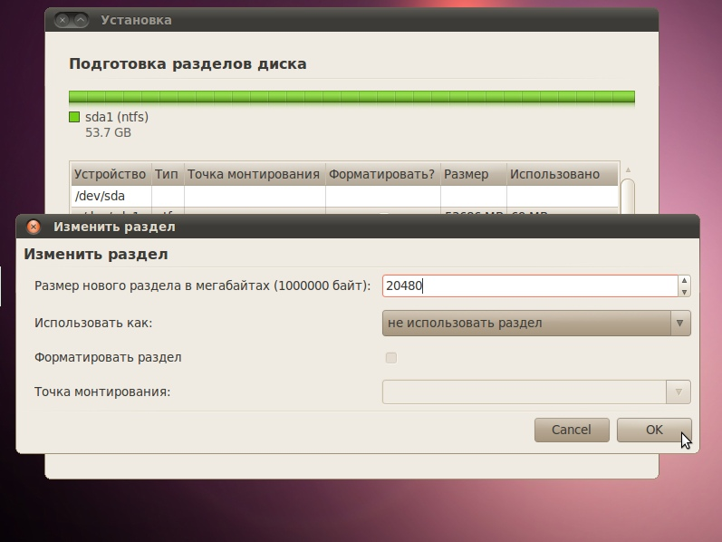

# Установка Linux

## Содержание

1. [Выбор дистрибутива](#выбор-дистрибутива)
2. [Создание загрузочного USB-диска](#создание-загрузочного-usb-диска)
3. [Подготовка жесткого диска средствами Windows](#подготовка-жесткого-диска-средствами-windows)
4. [Загрузка с подготовленной USB-флешки](#загрузка-с-подготовленной-usb-флешки)
5. [Установка Linux](#установка-linux)

## Выбор дистрибутива

Итак, прежде чем понять, как перестать бояться и полюбить Linux, нужно определиться, какой дистрибутив Вы хотите использовать в дальнейшем. Если это не первый Ваш опыт установки ОС семейства Linux, можно смело пропускать этот шаг (как и, скорее всего, все остальные). Иначе можем посоветовать следующие дистрибутивы:

### Стандартное решение — Ubuntu Linux 18.04 LTS

Один из самых популярных и привлекательных дистрибутивов. Как следствие, многие уже столкнулись даже с самыми экзотическими ошибками и описали пути их решения на всевозможных форумах

#### Плюсы

- развитое, дружелюбное сообщество, готовое помогать;
- высокая безопасность;
- хорошая поддержка оборудования — большинство конфигураций PC не требуют дополнительной настройки после установки ОС;
- хороший центр приложений (но это имеет малое значение, т.к. скоро вашим хорошим другом станет терминал);

#### Минусы

- есть проблемы со стабильностью — на некоторых малораспространенных комплектующих система вдруг может начать капризничать после очередного обновления, но, к счастью, решение почти всегда находится очень быстро на тематических форумах;
- пользовательский интерфейс максимально непривычен для тех, кто пользовался только Windows.

Скачать можно [здесь](https://www.ubuntu.com/download/desktop).

### Для не очень мощных компьютеров — Lubuntu 18.04

Та же Ubuntu, только с более легковесной графической оболочкой LXDE. Соответственно, недостатки и преимущества те же, за исключением того, что эта система отлично себя чувствует на стареньких ноутбуках, в отличие от предыдущего дистрибутива.

Скачать можно [здесь](https://lubuntu.net/downloads/).

### Для тех, кто никогда не пользовался Linux — Linux Mint 19

Также базируется на Ubuntu 18.04. Основное преимущество — простота графического интерфейса. Для тех, кто ранее пользовался только Windows, оболочка будет максимально простой и понятной.

Скачать можно [здесь](https://linuxmint.com/download.php). Рекомендуем качать дистрибутив с графической оболочкой Cinnamon (именно она показана на скриншоте).

## Создание загрузочного USB-диска

Итак, Вы выбрали и скачали наиболее подходящий Вам дистрибутив. Далее нужно как-то поселить его в Вашем компьютере. Для этого потребуется создать загрузочную USB-флешку.

Для начала нужно скачать программу [UNetbootin](https://unetbootin.github.io/), с помощью которой и будет создаваться загрузочная флешка. Далее нужно найти саму флешку объемом 8+ ГБ.

Теперь можно приступить к созданию загрузочного диска. Отформатируйте флешку в FAT32 со стандартными параметрами (все данные с флешки нужно сохранить перед этим шагом, т.к. она будет очищена).

Далее запустите UNetbootin и в появившемся окне выберите пункт «Образ диска», укажите путь к загруженному ранее дистрибутиву, а также носитель, который станет загрузочным диском. Далее нужно нажать «ОК» и ждать :)

## Подготовка жесткого диска средствами Windows

После того, как загрузочная флешка создана, нужно освободить место под устанавливаемую систему. Если Вы устанавливаете Linux на компьютер без установленной на нём ОС, этот шаг нужно пропустить.

Для того, чтобы освободить немного места под вторую систему, нужно запустить стандартную утилиту Windows «Управление дисками». В Windows 10 и Windows 8.1 её можно найти в меню, вызываемом кликом ПКМ по кнопке «Пуск».

Далее нужно выбрать раздел, от которого Вы можете отрезать необходимый объем памяти. Не рекомендуем проводить эту операцию над системным разделом. Если есть возможность уменьшить размер диска с пользовательскими данными (например, D:/), используйте его.

> Важно! Перед продолжением рекомендуем выгрузить все важные данные (дипломная работа, фото любимого кота и т.д.) на съемный носитель или в облачное хранилище, т.к. от неаккуратных действий никто не застрахован
> Далее нужно кликнуть по выбранному разделу ПКМ и в появившемся меню выбрать пункт «Сжать том». Помните, что невозможно отрезать от раздела больше места, чем свободного на нём на данный момент.

Далее нужно указать, до какого размера Вы хотите уменьшить выбранный раздел. Образовавшаяся нарезмеченная область будет позже использована для установки Linux. Для комфортной работы с новой системой стоит оставить около 100ГБ свободного места.

Если Вы всё сделали правильно, Ваш раздел уменьшится, а справа от него появится черная полоска неразмеченной области. Всё выглядит именно так? Поздравляем! Можете переходить к следующему этапу.

## Загрузка с подготовленной USB-флешки

Для того, чтобы загрузиться с флешки, которую мы подготовили, необходимо:

1. Вставить флешку в разъем USB
2. Перезагрузить ПК
3. При загрузке зайти в BIOS. Если не знаете, как это сделать на вашем компьютере, поможет только запрос в Google: «Как зайти в биос на {модель материнской платы или ноутбука}», т.к. на разных устройствах этот процесс происходит по-разному.
4. Найти в BIOS вкладку «Boot» или «BIOS» и настроить в ней «Boot priority», т.е. выставить приоритет устройств, на которых при включении ПК будет происходить поиск ОС. На первое место нужно поставить загрузочную флешку с Linux, а остальные позиции стоит сохранить в том порядке, в котором они находились до Вашего вмешательства.

Если всё сделано правильно, то после сохранения параметров BIOS и перезагрузки вы увидите экран, предлагающий установить систему или попробовать её прямо на флешке (в этом случае к установке можно будет перейти, кликнув по ярлыку на рабочем столе).

## Процесс установки

На начальном этапе установки потребуется выбрать язык установки и раскладку клавиатуры. Для начала рекомендуем выбрать английский, т.к. в большинстве случаев пароли и имена пользователей состоят из латинских симолов, русскую раскладку можно будет добавить в настройках после установки.

Далее программа установки может спросить, установить ли новую ОС рядом с Windows, если она была установлена ранее. Стоит выбрать пункт «Указать разделы вручную», т.к. при автоматической установке новые разделы могут быть организованы не самым удобным образом.

Далее нужно создать на неразмеченной области следующие разделы:

- Системный раздел — ~30 ГБ. Точка монтирования — «/». Файловая система — ext4.
- Раздел подкачки — не обязателен, размер равен объему оперативной памяти на вашем ПК. Файловая ситема — swap. Точка монтирования не указывается. Раздел будет использован при недостатке оперативной памяти.
- Домашний раздел — всё оставшееся неразмеченное пространство. Файловая система — ext4. Точка монтирования — «/home». Здесь будут храниться все Ваши пользовательские данные (загрузки, проекты, мультимедиа и т.д.).
После того, как разделы созданы, нужно выбрать устройство для установки загрузчика (как правило - это /dev/sda).

В случае, если Вы устанавливаете систему на пустой жёсткий диск, придется также создать раздел размером ~100 МБ с файловой системой fat32 и точкой монтирования /boot/efi. Если ранее была установлена Windows 8.1 или Windows 10, например, то такой раздел уже был создан, и делать этого не нужно.
