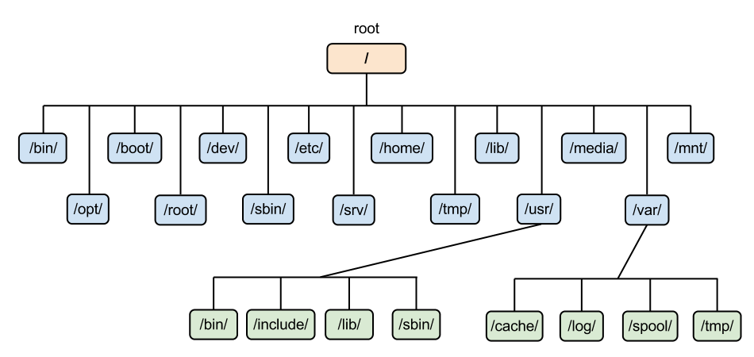
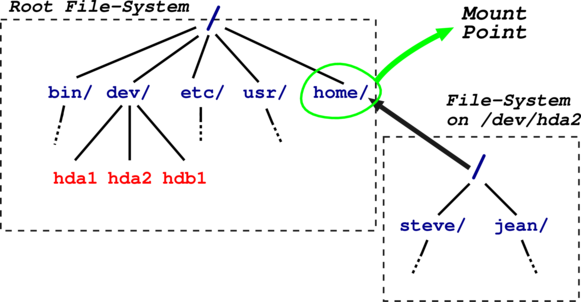

# Linux CheatSheet

## Краткий перечень базовых команд

**man** - означает manual. Выводит страницу руководства для указанного имени, поэтому если хотите получить всю информацию о какой-либо команде в Linux, то наберите: `man [command]`

**help** - показывает список базовых команд.

Также, у многих команд есть ключ **-help** или **--help** , который выводит информацию об использовании команды: список доступных ключей и синтаксис

**mount** - применяется для монтирования файловых систем

**cat** - означает concatenate. Используется в основном для вывода/объединения строк/файлов

**cd** - change directory. Позволяет сменить каталог

Возврат в предыдущий каталог: `cd - `

**ls** - печатает в стандартный вывод содержимое каталогов: `ls [directory]`

Вывод всех файлов, в том числе скрытых: `ls -a`

Вывод расширенной информации (например права доступа): `ls -l`

**cp -** копирования файлов и каталогов из одного в другой.

Копирование директорий целиком: `cp -r`

**mv** - используется для перемещения или переименования файлов

**rm** - используется для удаления файлов.

Удаление директории целиком: `rm -r`

**mc -** GNU Midnight Commander. Один из файловых менеджеров с текстовым интерфейсом типа Norton Commander. Перед использованием необходимо установить. Например, в Linux Mint или Ubuntu mc можно установить следующей командой: `apt install mc`

**sort** - утилита для вывода текстовых строк в определенном порядке: `sort data.txt`

**grep** - служит для поиска строк, содержащих заданный пользователем образец: `cat filename | grep filter`

**find** - утилита поиска файлов по имени и другим свойствам

**tail** - утилита в UNIX, выводящая несколько (по умолчанию 10) последних строк из файла. Вывод последних 100 строк: `tail -n 100`

**less** - утилита, выводящая содержимое файла целиком. Похожа на утилиту **more** , отличается от неё тем, что позволяет листать файл в оба направления, и имеет синтаксис команд, схожий с редактором **vi**.

**clear** - утилита для очистки текущего экрана

**chmod** - утилита для изменения прав доступа к файлам и каталогам

В целом подход unix подобных систем - это куча утилит, которые делают свою небольшую работу, но делают это хорошо. Хорошим примером является архивирование в Linux:

**tar** - кладет множество файлов в один

**gzip** - делает из большого файла маленький.
Поэтому архивы в Linux **.tar.gz** , и чтобы разархивировать файл вы можете выполнить: `tar -xvzf archive-name.tar.gz`

## Стандартный ввод и вывод

К любому процессу в unix подключены 3 основных потока ввода вывода:

0. **stdin** - стандартный ввод
1. **stdout** - стандартный вывод
2. **stderr** - стандартный вывод ошибок

Поэтому вы можете:  
- Перенаправить вывод в файл, полностью перезаписав его: `1 > filename`
- Перенаправить вывод в файл, дописав в него: `1 >> filename`
- Перенаправить вывод ошибок в файл: `2 > filename`

**Pipes**

Также вы можете вывод предыдущей команды направить на вход следующей команды: `curl http://example.com 2>/dev/null | grep title`

Попробуйте выполнить данную команду сами.

**2 > /dev/null** - перенаправляет вывод ошибок в dev/null

**dev/null** - специальный файл в системах класса UNIX, представляющий собой так называемое «пустое устройство». Запись в него происходит успешно, независимо от объёма «записанной» информации.

**curl** - утилита позволяющая взаимодействовать с множеством различных серверов по множеству различных протоколов с синтаксисом URL. В данном примере служит для загрузки html странички.

**|** - и есть pipe, который передает результат команды curl в команду grep

## Environment

Каждый процесс запускается в каком-то окружении, в котором есть определенный набор переменных.

**env** - выводит текущие переменные окружения

**export** - задает переменную в рамках текущего сеанса

**echo** - команда для вывода строк на экран терминала, в том числе её можно использовать для вывода переменных окружения

Например домашний каталог текущего пользователя: `echo $HOME`

## Файловая система

В Linux единая файловая система и выглядит она как-то так:

**/** - корневой каталог;

**/bin** – содержит стандартные утилиты Linux (основные исполняемые файлы)

**/boot** – содержит конфигурационные файлы загрузчика GRUB, образы ядра и т.д.

**/dev** – содержит файлы устройств. В Linux устройством называется оборудование, которое подключается к системе в процессе загрузки ядра или в процессе работы системы. Эти устройства представляют методы для ввода или вывода информации. Например, жесткий диск – устройство для ввода (запись) и вывода (чтение), мышь – устройство ввода.

**/etc** - содержит конфигурационные файлы операционной системы и всех сетевых служб. Данный каталог можно сравнить с реестром Windows, но в Windows общесистемные настройки хранятся в одном большом бинарном файле, а в Linux - в разных конфигурационных файлах, которые можно редактировать обычным текстовым редактором.

**/home** – здесь содержатся домашние каталоги всех пользователей, которые зарегистрированы в системе. В домашних каталогах пользователей хранятся пользовательские файлы, а также пользовательские настройки различных программ. Каждый пользователь имеет свой уникальный и неповторимый каталог для своих личных, персональных файлов: `/home/user_name`

Такое разделение пользовательских каталогов и файлов операционной системы упрощает сохранение данных и повышает надежность самой операционной системы.

**/lib** – здесь находятся различные библиотеки и модули ядра. В процессе установки различных программ в Linux (в том числе и драйверов) устанавливаются зависимости для корректной работы программы. Вот эти зависимости в большинстве случаев и есть библиотеки – набор собранных особым образом файлов, которые подключаются во время установки к устанавливаемой программе.

**/opt** – здесь обычно размещаются установленные программы, например Google Chrome

**/root** - каталог пользователя root.

**/tmp** -  каталог, в котором хранятся временные файлы

**/usr** – содержит пользовательские программы, документацию, исходные коды программ и ядра

**/var** - содержит файлы, которые подвергаются наиболее частому изменению. Например, кэши различных программ, журнальные файлы и т.д.

Файловая система одна, но физических устройств, из которых она состоит, может быть несколько. Можете почитать про **монтирование** , если хотите разобраться в данном вопросе.

## Немного о root и sudo

В любой Linux-системе обязательно есть один привилегированный пользователь — **root**. Этот пользователь имеет права на выполнение любых действий, удаление любых файлов и изменение любых параметров.

С другой стороны, все остальные пользователи системы обычно не имеют большинства необходимых прав, например, прав на установку программ, поскольку это является административной операцией, права на которую есть только у **root**. Ещё одной распространённой операцией, доступной только суперпользователю, является копирование и изменение файлов в системных папках, куда обычный пользователь доступа не имеет.

Раньше данная проблема решалась командой **su** , позволяющей пользователю войти в систему под другим именем, не завершая текущий сеанс.

Но в последнее время вместо root аккаунта для администрирования используется утилита **sudo** , предоставляющая привилегии root для выполнения административных операций в соответствии со своими настройками. Если говорить простым языком, то мы выполняем команду как бы от root пользователя. По умолчанию в Ubuntu и Linux Mint первый пользователь в системе может использовать команду **sudo**.

Для расширенной настройки использования команды sudo или добавления пользователей, которые могут использовать команду **sudo** , необходимо отредактировать файл `/etc/sudoers`.
