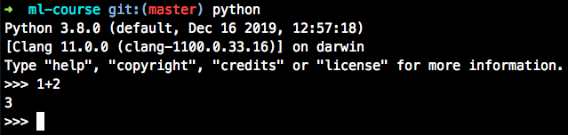

# Установка Python

[Видео: установка python с помощью pyenv](https://www.youtube.com/watch?v=oow8GgBB2oM&t=0s&list=PLLyuiBK_HOLNm8T5Xtl7dDquJey917TXy&index=3).

В дистрибутивах linux можно установить Python сразу из терминала, но я предлагаю пойти более правильным путём и установить [менеджер версий python](https://github.com/pyenv/pyenv). Это может вам пригодиться в будущем.

## PyEnv

Следуем официальному туториалу и ставим [github.com/pyenv/pyenv](https://github.com/pyenv/pyenv#basic-github-checkout).

> pyenv lets you easily switch between multiple versions of Python. It's simple, unobtrusive, and follows the UNIX tradition of single-purpose tools that do one thing well.

```shell
git clone https://github.com/pyenv/pyenv.git ~/.pyenv
echo 'export PYENV_ROOT="$HOME/.pyenv"' >> ~/.bashrc
echo 'export PATH="$PYENV_ROOT/bin:$PATH"' >> ~/.bashrc
echo -e 'if command -v pyenv 1>/dev/null 2>&1; then\n  eval "$(pyenv init -)"\nfi' >> ~/.bashrc
# restart terminal
```

```shell
pyenv install 3.7.0
pyenv global 3.7.0
```

Проверим версию, вызвав в терминале команду:

```shell
python --version
pip --version
```

Запустим интерпретатор:

```shell
python
# запустился интерпретатор
1 + 2
# должно вывести 3, как на рисунке
```



## Возможные проблемы

### `ValueError: unknown locale: UTF-8` в Unix и OS X при запуске кода

Надо добавить в файл `~./bash_profile` строки:

```shell
export LC_ALL=en_US.UTF-8
export LANG=en_US.UTF-8
```

Если Вы не умеете редактировать файлы, то просто введите эти две команды в
командной строке и перезапустите консоль:

```shell
echo 'export LC_ALL=en_US.UTF-8' >>~/.bash_profile
echo 'export LANG=en_US.UTF-8' >>~/.bash_profile
```

Самый ленивый вариант. Каждый раз перед запуском ipython notebook прописывайте
следующие две строчки в консоль:

```shell
export LC_ALL=en_US.UTF-8
export LANG=en_US.UTF-8
```
