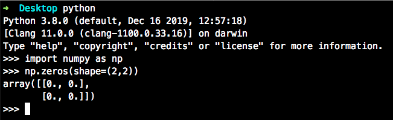

# Установка библиотек Python

[Видео: установка библиотек с помощью pip](https://www.youtube.com/watch?v=PJOwwVrcPww&t=0s&list=PLLyuiBK_HOLNm8T5Xtl7dDquJey917TXy&index=4).

Чтобы установить библиотеку Python, можно сипользовать утилиту `pip`. Она находит пакет по имени в хранилище проектов [pypi.org](https://pypi.org/project/pip/), скачивает его, ставит дополнительные зависимости, настраивает сам пакет(если необходимо, то будет компилировать с/с++/fortran библиотеки).

## Научные пакеты

В курсе мы будем использовать пакеты научных вычислений на Python. Подробнее о них вы можете прочитать на сайте [scipy.org](https://www.scipy.org/about.html).

Установим необходимые для курса пакеты:

```shell
pip install numpy scipy scikit-learn Pillow jupyter pandas sympy nose matplotlib seaborn plotly
```

Или вы можете выполнить `pip install -r requirements.txt`. Файл requirements.txt преподаватели добавили в вашем репозитории для ДЗ.

**Внимание**, для установки python пакетов вам не нужны права супер пользователя, значит вводить `sudo pip install` не надо!

Проверим, что пакеты установились:

```shell
python # запустили интерпретатор
import numpy as np # импортировали пакет numpy, доступ к нему будет через имя np
np.zeros(shape=(2,2)) # создалим матрицу 2x2 из нулей и выведем в консоль
```


