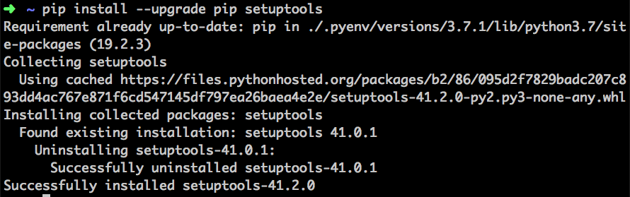

# Структура Python проекта

## Настройка виртуального окружения для проекта

Поскольку в Вашей системе уже есть python и используется некоторыми службами (например, графической оболочкой), то ставить на системный питон какие-то пакеты, нужные нам для задач - не очень, т.к. может произойти конфликт версий и что-нибудь в системе не будет работать корректно (личный опыт - для запуска модели на моём ноутбуке мне требовалась более новая версия scikit-image, но после установки у меня перестали работать настройки экрана, пришлось откатываться). Для решения этой проблемы было придумано виртуальное окружение - выбранная нами версия python и требующиеся для проекта библиотеки теперь лежат в проекте, и в каждом они свои.

1. Открываем папку с проектом, открываем в ней консоль
2. Прописываем `pyenv local 3.8.5` (можно использовать более новую версию, главное чтобы библиотеки заработали). Так мы указали, что в этой папке мы используем строго эту версию
3. Далее создаём виртуальное окружение командой `python -m venv venv` (второе `venv` это название папки с окружением)
4. Подключаемся к окружению командой `source venv/bin/activate`
5. Проверям `which pip`, должно быть `/absolute_path_to_the_project/venv/bin/pip`.
6. Вызываем `pip install --upgrade pip setuptools`, чтобы обновить инструменты сборки и pip:



7. Далее нужно установить в наше виртуальное окружение нужные библиотеки. Варианта 2:
   1. `pip install` перечисление всех библиотек через пробел: `pip install numpy pandas matplotlib`.
   2. `pip install -r requirements.txt`

## requirements.txt

requirements.txt - это файл с перечисленными через перевод строки требующимися библиотеками (иногда с указанием версий)

- должен лежать в репозитории
- позволяет одной командой установить все нужные зависимости

Заполнять этот файл нужно вручную в соответствии с тем, какие библиотеки вы устанавливали в процессе создания проекта.

Пример содержимого:

```conf
# requirements.txt
# - это комментарий в файле
numpy
pandas
scikit-learn
scipy
scikit-image
vk_api
```

requirements.txt не всегда должен совпадать с `pip list`, закидывайте только то, что нужно непосредственно Вам (pip list отражает всё установленное, некоторые библиотеки оттуда нужны для работы нужных нам библиотек или для обеспечения безопасности системы, мы к ним напрямую обращаться не будем, соответственно и указывать их не надо).

## Git

Чтобы в репозиторий не закоммитились ненужные файлы, создают специальный файл в корне проекта `.gitignore`, в котором перечисляют файлы, которыйе нужно игнорировать.

Можно сгенерировать с помощью сайта [gitignore.io](https://www.gitignore.io/).

Пример содержимого:

```conf
venv
*.pyc
__pycache__/
# Linux
*~
.Trash-*
.nfs*
# IDE
.idea
```

### Чек-лист для gitignore

В репозитории остаются:

- исходники
- тесты
- конфиги
- служебные файлы типа .gitignore, .python-version, .editorconfig и т.п.

В .gitignore пишется:

- .idea
- venv
- прочие файлы связанные с IDE, т.к. вынести из папки проекта мы не можем, а удалять и создавать каждый раз затратно

- выносятся из папки проекта наружу:
  - данные
  - сохранённые модели

## Среда разработки

### .editorconfig

Удобный способ пользоваться одинаковыми настройками IDE на разных машинах ничего не перенастраивая.
Также лежит в репозитории.
Пример:

```conf
root = true
[*]
indent_style = space
indent_size = 4
end_of_line = lf
charset = utf-8
trim_trailing_whitespace = true
insert_final_newline = true
[*.md]
trim_trailing_whitespace = false
[Makefile]
indent_style = tab
[*.{cpp,c,hpp,h}]
indent_size = 2
```

### Makefile

Невероятно полезная вещь, призванная автоматизировать все предыдущие шаги для быстрого развёртывания новых проектов.

[Классный туториал по makefile](https://github.com/inem/make-handbook/releases/download/v0.6/modern-make-handbook-ru.pdf).

```makefile
# Отступы должны быть табуляциями!!! При копировании могло заменить на пробелы.
all: pyenv-activate create-venv deps

run:
    PYTHONPATH=src venv/bin/python src/main.py

deps:
    venv/bin/pip install --upgrade pip
    venv/bin/pip install --upgrade setuptools
    venv/bin/pip install -r requirements.txt

create-venv: pyenv-activate
    python -m venv venv

pyenv-activate:
    pyenv local # it get info from .python-version file

.PHONY: deps create-venv pyenv pyenv-activate
```
